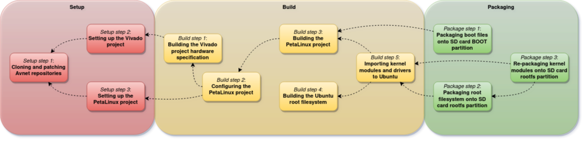

# MPSoC4Drones

██████╗░██╗██╗██╗  
██╔══██╗██║██║██║  
██║░░██║██║██║██║  
██║░░██║██║██║██║  
██████╔╝██║██║██║  
╚═════╝░╚═╝╚═╝╚═╝

🄳🅁🄾🄽🄴 🄸🄽🄵🅁🄰🅂🅃🅁🅄🄲🅃🅄🅁🄴 🄸🄽🅂🄿🄴🄲🅃🄸🄾🄽 🄰🄽🄳 🄸🄽🅃🄴🅁🄰🄲🅃🄸🄾🄽

🅂🄳🅄.🄳🄺/🄳🄸🄸🄸

🄶🄸🅃🄷🅄🄱.🄲🄾🄼/🄳🄸🄸🄸-🅂🄳🅄-🄶🅁🄾🅄🄿

MPSoC project framework for UAV research applications targeting the Ultra96-V2 as UAV companion computer with external PX4 powered flight controller. Tool chain for building images with custom programmable logic design, Ubuntu 20.04, and ROS2. The framework is a wrapper of existing tools for embedded development probvided by Xilinx as well as scripts provided by Avnet for building projects for the Ultra96-V2.

Prerequisites:

- **Host Platform**: [Ubuntu 20.04 LTS](https://releases.ubuntu.com/20.04/)
- **Tools**: Xilinx [Vivado 2020.2](https://www.xilinx.com/support/download/index.html/content/xilinx/en/downloadNav/vivado-design-tools/2020-2.html) + Xilinx [PetaLinux 2020.2](https://www.xilinx.com/support/download/index.html/content/xilinx/en/downloadNav/embedded-design-tools/2020-2.html)
- At least a 16 GB SD card

The work uses:

- **Target Platform**: [Ubuntu Base 20.04 LTS for Arm64](http://cdimage.ubuntu.com/ubuntu-base/releases/20.04/release/)
- **Target Middleware**: [ROS2 Foxy](https://docs.ros.org/en/foxy/Installation.html)
- **Target Development Board**: Avnet [Ultra96-V2](https://www.avnet.com/shop/us/products/avnet-engineering-services/aes-ultra96-v2-g-3074457345638646173/) with Avnet [U96 JTAG/UART to USB adapter](https://www.avnet.com/shop/us/products/avnet-engineering-services/aes-acc-u96-jtag-3074457345635355958/)

## Features
This work aims to provide an easy-to-use framework for integration projects targeting the Ultra96-V2 board. The framework facilitates integration of FPGA programmable logic design with well-established tools in the UAV research community.

The framework lets you
- Handle the full process of boot image creation for custom UAV applications targeting the Ultra96-V2 board;
- Design full project specific FPGA layouts from a bare-minimum default block design in Xilinx Vivado 2020.2;
- Handle a PetaLinux project using either custom or default FPGA design;
- Automatically incorporate Ultra96-V2 specific meta-layers provided from Avnet into the PetaLinux project;
- Modify the meta-layers of the PetaLinux project in compliance with custom FPGA designs;
- Build the Vivado project and PetaLinux project;
- Build an Ubuntu 20.04 root filesystem ready with ROS2 Foxy and Fast-RTPS for PX4 Flight Controller communication; and
- Package integrated FPGA layout and OS onto a bootable SD card.

## Getting started
This section gives a quick introduction on how to get started with MPSoC4Drones.

### The Toolchain at a glance
The toolchain consists of the following three steps:
1. **Setup**  
Setting up the project structure. In this step, the relevant Avnet repositories are cloned and patched, the Vivado project is generated, and the PetaLinux project is created.
3. **Build**  
Bulding the individual project components. This step contains the building process of the Vivado project, the PetaLinux project, and the Ubuntu root filesystem.
5. **Packaging**  
Packaging the build products. This step covers packaging the build products onto a prepared SD card as well as creating an image for SD card flashing.

### Environment setup

Clone the repository: 

```bash
git clone https://github.com/DIII-SDU-Group/MPSoC4Drones.git
```

Enter the cloned directory:

```bash
cd MPSoC4Drones/
```

Source the MPSoC4Drones settings script:

```bash
source scripts/settings.sh
```

The available commands will be shown in the terminal. Also source your 2020.2 Xilinx tools from the Vivado and PetaLinux installation directories, e.g.

```bash
source /tools/Xilinx/Vivado/2020.2/settings64.sh
source /tools/Xilinx/PetaLinux/2020.2/tool/settings.sh
```

Now you're ready to develop with MPSoC4Drones!

### Toolchain execution
To setup the sub projects, i.e. clone and patch Avnet repositories, setup Vivado project, and setup PetaLinux project, simply run the following command:

```bash
mp4d-setup
```

To build all sub-projects, i.e. build the Vivado project, build the PetaLinux project, and build the Ubuntu root filesystem, simply issue the following command:

```bash
mp4d-build
```

This step will take a while.

Assuming you SD-card is formated as described in the [SD-card setup](#sd-card-setup) section and mounted at mount points `/media/$USER/BOOT` and `/media/$USER/rootfs`, the SD-card is packaged by commanding

```bash
mp4d-package
```

The SD-card is now ready for boot. 

### First boot
Plug the SD-card into the Ultra96-V2, plugin the power, connect the JTAG-adapter, and connect the USB cable to the host computer. Open a serial session at baudrate 115200, e.g. using `screen`. Push the power button on the Ultra96-V2. You will now be able to monitor the boot process, first the boot loader, then the kernel, and finally Ubuntu.

When prompted for a login, supply `u96` as both login and password.

Before constructing a custom ROS2 system, build the PX4 Fast-RTPS ROS2 nodes. This only needs to be done once, and is done as follows:

```bash
export MAKEFLAGS= "-j 3"
source ~/ros2_ws/src/px4_ros_com/scripts/build_ros2_workspace.bash
```

Using only 3 jobs prevents starvation. This will take a while to finish.

Now, your system is ready for use.

## Development with MPSoC4Drones
Development with the MPSoC4Drones framework is straightforward. This section explains the framework in greater details and provides examples on how to use the toolchain in different development scenarios.

### The framework
The framework consists on a directory structure and a set of command line tools, and everything is suplied within this repository. One instance of the repository is cloned for one MPSoC4Drones project. The tools then provide functionality to generate everything necessary.

After cloning the repository and entering the repository directory, the tools are sourced as follows:

```bash
source scripts/settings.sh
```

The individual commands and functionalities are explained below.

#### `mp4d-setup`
The `mp4d-setup` command sets up the project structure in the three following steps:
1. _Setup step 1_: **Cloning and patching the Avnet repositories**.  
Avnet provides scripts for building projects for their boards in seperate GitHub repositories which interoperate. Therefore, the general project structure is adopted from Avnet. The cloned Avnet repositories are the following:
    - the *bdf* repository cloned into the `bdf/` folder. This folder will contain the Avnet provided board definition files for the Ultra96-V2, which is used in Vivado to specify the characteristics of the board.
    - the *hdl* repository cloned into the `hdl/` folder. This folder will contain the Vivado specific scripts for project creation and hardware building. The repository is patched from the original provided by Avnet in order to more flexibly facilitate hardware development in Vivado, and also to define a bare minimum Vivado project necessary for the OS to be able to run. Inside this folder will also be contained the actual Vivado project for the MPSoC4Drones project.
    - the *petalinux* repository cloned into the `petalinux/` folder. This folder will contain the PetaLinux specific scripts for project creation and PetaLinux building. The repository is patched from the original provided by Avnet in order to more flexibly facilitate development with/without updating the hardware specification, without rebuilding everything, etc. Inside this folder will also be contained the actual PetaLinux project for the MPSoC4Drones project.
    - the *meta-avnet* repository cloned into the `meta-avnet/` folder. This folder will contain the meta-layers provided by Avnet for the PetaLinux build. These layers define, among other things, patches to the kernel, hardware drivers, etc., specific to the Ultra96-V2, as well as the kernel driver configuration for the PetaLinux project. The repository is patched from the original provided by Avnet in order to remove specification of excessive packages to be installed in the user layer of the root filesystem built by PetaLinux, as this filesystem is replaced in MPSoC4Drones by a Ubuntu 20.04 filesystem, and this modification significantly decreases build time, as well as to add some additional kernel drivers necessary for PX4 communication to the build.
2. _Setup step 2_: **Setting up the Vivado project**.  
Using the scripts in the patched version of the Avnet *hdl* repository now contained in the `hdl/` folder, the Vivado project is created on the path `hdl/projects/u96v2_sbc_mp4d_2020_2/`. The default bare-minimum block design is generated, the board definition files are added, and a constraints file is added to the project for reference and later pinout. This step requires that _setup step 1_ has been executed.
3. _Setup step 3_: **Setting up the PetaLinux project**.  
Using the scripts in the patched version of the Avnet *petalinux* repository now contained the `petalinux/` folder, the PetaLinux project is created on the path `petalinux/projects/u96v2_sbc_mp4d_2020_2/`. This step requires that _setup step 1_ has been executed.

The command has the following options:
- Calling `mp4d-setup`, `mp4d-setup -A`, or `mp4d-setup --all` will issue _setup step 1_, _2_, and _3_ above. For any step that has already been executed, the user will be prompted for yes/no about whether the setup should continue and erase all previous changes.
- Calling `mp4d-setup` with one or more of the following options will issue the respective steps:
  - `-G`, `--git` for _setup step 1_,
  - `-V`, `--vivado` for _setup step 2_, and
  - `-P`, `--petalinux` for _setup step 3_.  
The `-A`, `--all` option will overrule the above options and issue all steps regardless.
- For any step, the user will be prompted if the step has already been executed. Adding the `-f`, `--force` option will overwrite previous changes without prompting the user for yes/no.

In general, the `mp4d-setup` command only needs to be called once during project creation, but can also be useful if the user wants to reset parts of the MPSoC4Drones project to default.

#### `mp4d-build`
The `mp4d-build` command builds the project in the five following steps:
1. _Build step 1_: **Building the Vivado project hardware specification**.  
This step runs synthesis and implementation on the Vivado project contained in the `hdl/projects/u96v2_sbc_mp4d_2020_2/` folder. The build utilizes the patched versions of the Avnet hdl build scripts. The design bitstream is generated and the hardware specification .xsa file is exported. This step requires that _setup step 2_ has been executed.
2. _Build step 2_: **Configuring the PetaLinux project**.  
This step configures the PetaLinux project for build, imports the generated hardware specification, and imports the Avnet meta-layers. This step requires that _setup step 3._ and _build step 1_ have been executed.
3. _Build step 3_: **Building the PetaLinux project**  
This step builds the PetaLinux project contained in the `petalinux/projects/u96v2_sbc_mp4d_2020_2/` folder, including the boot loader and the kernel. The boot files are stored in the directory `target/BOOT/`. This step requires that _build step 2_ has been executed.
4. _Build step 4_: **Building the Ubuntu root filesystem**  
This step builds the Ubuntu 20.04 root filesystem, including installing necessary packages, setting up the root user and the primary user, installing ROS2, and setting up PX4 Fast-RTPS communication. The built root filesystem is contained in the directory `target/rootfs/`.
5. _Build step 5_: **Importing kernel modules and drivers to the Ubuntu root filesystem**  
This step imports the kernel modules and drivers from the PetaLinux build to the Ubuntu root filesystem contained in the `target/rootfs/` folder. This step requires that _build step 3_ and _build step 4_ have been executed.

The command has the following options:
- Calling `mp4d-build`, `mp4d-build -A`, or `mp4d-build --all` will issue _build step 1_, _2_, _3_, _4_, and _5_. For any step that has already been executed, the user will be prompted for yes/no about whether the build should continue and erase all previous build outputs.
- Calling `mp4d-build` with one or more of the following options will issue the respective steps:
  - `-V`, `--vivado` for _build step 1_,
  - `--petalinux-config` for _build step 2_,
  - `-P`, `--petalinux` for _build step 3_,
  - `-U`, `--ubuntu` for _build step 4_, and
  - `--ubuntu-import-modules` for _build step 5_.  
The `-A`, `--all` option will overrule the above options and issue all steps regardless.
- For any step, the user will be prompted if the step has already been executed. Adding the `-f`, `--force` option will overwrite previous build products without prompting the user for yes/no.

_Build step 4_ and _5_ requires sudo priviledges and will prompt the user for password. The `mp4d-build` command is used iteratively with various options throughout the development process when new changes are tested.

#### `mp4d-package`
The `mp4d-package` command packages the project build products in the following steps:
1. _Packaging step 1_: **Packaging boot files onto SD card BOOT partition**.  
This step packages the BOOT files contained in the `target/BOOT/` folder onto the BOOT partition of the SD card. This step requires that _build step 3_ has been executed.
2. _Packaging step 2_: **Packaging the root filesystem onto the SD card rootfs partition**.  
This step packages the full root filesystem contained in the `target/rootfs/` folder on the rootfs partition of the SD card. This step requires that _build step 5_ has been executed.
3. _Packaging step 3_: **Packaging just the kernel modules and drivers into the root filesystem on the SD card rootfs partition**.  
This step can be executed if changes has been made to the PetaLinux build but not the Ubuntu build and the root filesystem has already once been packaged to the SD card. In this step, only the kernel modules and drivers are updated in the SD card rootfs partition to save time. As such, _packaging step 3_ is a subset of the work done in _packaging step 2_. This step requires that _packaging step 2_ has been executed with the rootfs partition on the SD card and that _build step 5_ has since been rerun.

 The command has the following options:
- Calling `mp4d-package`, `mp4d-pacakge -A`, or `mp4d-package --all` will issue _package step 1_ and _2_. For any step that has already been executed, the user will be prompted for yes/no about whether the packaging should continue and erase previous packaged contents on the SD card.
- Calling `mp4d-package` with one or more of the following options will issue the respective steps:
  - `-B`, `--boot` for _packaging step 1_,
  - `--rootfs` for _packaging step 2_, and
  - `--kernel-modules` for _packaging step 3_.
The `-A`, `--all` option will overrule the above options and issue all steps regardless.
- The `--mount-dir MOUNT_DIR` argument can be used to specify the directory `MOUNT_DIR` containing the `BOOT/` and `rootfs/` mount points. `MOUNT_DIR` defaults to `/media/$USER/`.
- The `--boot-dir BOOT_DIR` argument can be used to specify the BOOT partition mount point `BOOT_DIR`. Setting this argument will overwrite the BOOT partition mount point derived from `MOUNT_DIR`. As such, `BOOT_DIR` defaults to `MOUNT_DIR/BOOT/`.
- The `--rootfs-dir ROOTFS_DIR` argument can be used to specify the rootfs partition mount point `ROOTFS_DIR`. Setting this argument will overwrite the ROOTFS partition mount point derived from `MOUNT_DIR`. As such, `ROOTFS_DIR` defaults to `MOUNT_DIR/rootfs/`.
- For any step, the user will be prompted if the step has already been executed. Adding the `-f`, `--force` option will overwrite previously packaged build products on the SD card without prompting the user for yes/no.

### The toolchain



### Programmable logic synthesis
In order to generate a hardware specification file (XSA), we use the Vivado project that was initialised in the [previous step](#repository-setup).

Open Vivado 2021.1 and open the project file, e.g.

```bash
vivado vivado_project/U20U96.xpr
```

Press *Open Block Design*.

You now see the **essential** hardware required for hosting the Ubuntu system. You have the option to add you own programmable logic design. We recommend that you package your design(s) as IP(s) and then include it in this block design. We have not had success with combining the blocks in the block design hierarchies, but if you succeed with this, please share your experience in an issue. Finally, if you need additional PL-PS communication, IO, etc., you are free to enable hardware blocks in the *Zynq Processing System* block or to add *AXI* devices to the design. You can of course connect your design to the *BRAM_PORTB* interface for direct shared memory with the processing system. Please also feel free to report any issues you might experience.

Once you design is as you like, press *Generate Bitstream* and configure your run as desired. Warning: Using too many jobs will take up a lot of RAM and swap memory, potentially resulting in Vivado crashing, so lower the number of jobs and take a coffee.

When the run is finished, generate the XSA file by
> 1. Press *File>Export>Export Platform...*
> 2. Press *Next >*
> 3. Make sure *Hardware* is chosen, then press *Next >*
> 4. Make sure *Pre-synthesis* is chosen, then tick *Include bitstream*, then press *Next >*
> 5. Press *Next >*
> 6. Press *Next >*
> 7. Press *Finish*

After a little processing, the XSA file has been generated.

**Attention**:
> If you haven't made any changes to the hardware which involves changed memory addresses or software driver (changes to the *Zynq Processing System* block or changes to or additional *AXI* devices), and you have previously built the image, you don't need to generate an XSA file and build the image from scratch again. You can simply use the boot files you have previously built and jump straight to [packaging](#packaging).

### Building the image
After obtaining the XSA file, it is time to build the image.

Make sure you're in the MPSoC4Drones directory. Source the PetaLinux environment settings script for the needed command set, e.g.

```bash
source <petalinux-2020.2-dir>/settings.sh
```
Then we create the PetaLinux project:

```bash
petalinux-create --type project --template zynqMP --name U20U96_petalinux
cd U20U96_petalinux
```

Configure the build with your XSA hardware definition file:

```bash
petalinux-config --get-hw-description ../vivado_project/u96v2_sbc_base_wrapper.xsa
```

This command will bring up the hardware system configuration editor. Apply the following settings (all of which are important - neglect might cause failure to boot):

> - In *Subsystem AUTO Hardware Settings > Serial Settings*, all *stdin/stdout* is `PSU_UART1` and the baudrate is 115200 
> - *Subsystem AUTO Hardware Settings > Advanced bootable images storage Settings > boot image settings > image name* is `BOOT.BIN`
> - *Subsystem AUTO Hardware Settings > Advanced bootable images storage Settings > boot image settings > image storage media* is `primary sd`
> - *Subsystem AUTO Hardware Settings > Advanced bootable images storage Settings > u-boot env partition settings > image storage media* is `primary sd`
> - *Subsystem AUTO Hardware Settings > Advanced bootable images storage Settings > kernel image settings > image storage media* is `primary sd`
> - *Subsystem AUTO Hardware Settings > Advanced bootable images storage Settings > dtb image settings > image storage media* is `primary sd`
> - *Subsystem AUTO Hardware Settings > SD/SDIO > Primary SD/SDIO* is `psu_sd_0`
> - *DTG Settings > MACHINE_NAME* is `avnet-ultra96-rev1`
> - *Image Packaging Configuration > Root filesystem type* is `EXT4 (SD/eMMC/SATA/USB)`
> - *Image Packaging Configuration > Copy final images to tftpboot* is unchecked (press n)

WIFI STUFF GOES HERE!


Then we are ready to build a bare minimum device tree for the Zynq MPSoC system. Run:

```
petalinux-build
```

This will take quite a while (few hours). :)

#### Packaging
Once the build is done, a boot image binary (BOOT.BIN) needs to be created from the first stage bootloader, FPGA bitstream, PMU firmware, and u-boot environment. Using the `petalinux-package` command, specify the paths to the bitstream and ELF files. The boot image binary file will be generated in this same directory. This step can be done if the programmable logic design has been changed without changing address specific parts. One simply needs to replace `images/linux/system.bit` with the new bitstream generated from Vivado.

Make sure you're in the PetaLinux project directory, e.g.

```bash
cd MPSoC4Drones/U20U96_petalinux/
```

Then, issue the following command:

```bash
petalinux-package --boot --fsbl images/linux/zynqmp_fsbl.elf --fpga images/linux/system.bit --pmufw images/linux/pmufw.elf --u-boot
```

Finally, create a BOOT folder to contain the generated boot files: TODO: Check this!!

```bash
mkdir BOOT
cp images/linux/boot.scr BOOT/
cp images/linux/image.ub BOOT/
cp images/linux/BOOT.BIN BOOT/
```

Done!

### Preparing the file system
Now we prepare the Ubuntu file system. This step is independent of the build process and can be done separately. Additionally, you can reuse this file system for other builds, as will be obvious.

Make sure you're in the PetaLinux project directory, e.g.

```bash
cd MPSoC4Drones/U20U96_petalinux/
```

Create the rootfs directory, get the Ubuntu base image, and extract it:

```bash
mkdir rootfs

wget http://cdimage.ubuntu.com/ubuntu-base/releases/20.04/release/ubuntu-base-20.04.1-base-arm64.tar.gz -O - | tar xpz -C rootfs/

sudo chown -R root rootfs/
sudo chgrp -R root rootfs/
```

We then proceed to add libraries to the rootfs from the host PC. 

Install the qemu tool if you don't already have it:

```bash
sudo apt install qemu-user-static
```

Copy these config files into the rootfs:

```bash
sudo cp -av /usr/bin/qemu-aarch64-static ./rootfs/usr/bin/

sudo cp -av /run/systemd/resolve/stub-resolv.conf ./rootfs/etc/resolv.conf
```

Create these mount points:

```bash
sudo mount --bind /dev/ ./rootfs/dev
sudo mount --bind /proc/ ./rootfs/proc
sudo mount --bind /sys/ ./rootfs/sys
```

`chroot` into the rootfs:

```bash
sudo chroot ./rootfs/
```

Update and upgrade (don't mind about an error saying that logs can't be written):
```bash
apt update
apt upgrade -y
```

Install `sudo`, as this is not installed (really scraped Ubuntu version) and you will definitely need it:

```bash
apt install sudo
```

Add a new user (here `u96`), create a password (here `u96`), and give sudo access to the user:

```bash
useradd -G sudo -m -s /bin/bash u96
echo u96:u96 | chpasswd

usermod -aG sudo u96
chown root:root /usr/bin/sudo && chmod 4755 /usr/bin/sudo
```

We then login as the new user in order to not install everything as root:

```bash
su - u96
```

> If you as user `u96` experience issues with using the `sudo` command, specifically if you see 
> ```bash
> sudo: effective uid is not 0, is /usr/bin/sudo on a file system with the 'nosuid' option set or an NFS file system without root privileges?
> ```
> Write `exit` to go back to root user, then execute
> ```bash
> mount
> mount -n -o remount,suid /
> ```
> Then change to `u96` user again:
> ```bash
> su - u96
> ```
> Then you should be good with the `sudo` command again! Let's continue...


Now, let's install some software on rootfs:

```bash
sudo apt -y install \
  locales \
  dialog \
  perl \
  ifupdown \
  net-tools \
  ethtool \
  udev \
  wireless-tools \
  iputils-ping \
  resolvconf \
  wget \
  apt-utils \
  wpasupplicant \
  devmem2 \
  nano \
  vim \
  kmod \
  openssh-client \
  openssh-server \
  build-essential \
  cmake \
  git \
  build-essential \
  libbullet-dev \
  curl \
  gnupg2 \
  lsb-release
```

Set some locale settings (needed for ROS2 repository):

```bash
sudo apt update && sudo apt install locales
sudo locale-gen en_US en_US.UTF-8
sudo update-locale LC_ALL=en_US.UTF-8 LANG=en_US.UTF-8
export LANG=en_US.UTF-8
```

Authorize the GPG key with apt like this:

```bash
sudo curl -sSL https://raw.githubusercontent.com/ros/rosdistro/master/ros.key  -o /usr/share/keyrings/ros-archive-keyring.gpg
```

Then add the repository to your sources list:

```bash
echo "deb [arch=$(dpkg --print-architecture) signed-by=/usr/share/keyrings/ros-archive-keyring.gpg] http://packages.ros.org/ros2/ubuntu $(lsb_release -cs) main" | sudo tee /etc/apt/sources.list.d/ros2.list > /dev/null
```

Install ROS2 related Python packages:

```bash
sudo apt update && sudo apt install -y \
  python3-colcon-common-extensions \
  python3-flake8 \
  python3-pip \
  python3-pytest-cov \
  python3-rosdep \
  python3-setuptools \
  python3-vcstool
```
Install some pip packages needed for testing:

```bash
python3 -m pip install -U \
  argcomplete \
  flake8-blind-except \
  flake8-builtins \
  flake8-class-newline \
  flake8-comprehensions \
  flake8-deprecated \
  flake8-docstrings \
  flake8-import-order \
  flake8-quotes \
  pytest-repeat \
  pytest-rerunfailures \
  pytest
```

Install Fast-RTPS dependencies:

```bash
sudo apt install --no-install-recommends -y \
  libasio-dev \
  libtinyxml2-dev
```

Install Cyclone DDS dependencies:

```bash
sudo apt install --no-install-recommends -y \
  libcunit1-dev
```

Finally, we install ROS2 Foxy base:

```bash
sudo apt install ros-foxy-ros-base
```

Add the ROS2 source script to `.bashrc`:

```bash
echo "source /opt/ros/foxy/setup.bash" >> ~/.bashrc
```

Create a workspace:

```bash
mkdir -p ~/ros2/src
```

And that's the furthest we can do with `chroot`. Now, the file system is ready.

Quit the qemu session by issuing the `exit` command twice:

```bash
exit
exit
```

Perform the following umount commads (very important!):

```
sudo umount  ./rootfs/dev
sudo umount  ./rootfs/proc
sudo umount  ./rootfs/sys
```

Now, we're ready to put things on the SD card.

### Preparing the SD card
You will need an SD card with at least 16 GB of memory.

The SD card needs to be partitioned. The partition map needs to be as following: First there must be 100 MiB of free space. Next, there needs to be a FAT32 partition labeled *BOOT* of size 1000 MiB. Finally, with no free space in between, the rest of the space must be formated as an EXT4 partition labeled *rootfs*. One can use the Ubuntu **gparted** app.

Mount the SD card to the host system (your PC), e.g. such that the partitions can be seen as `/mnt/BOOT/` and `/mnt/rootfs/`.

Make sure you're in the PetaLinux project directory, e.g.

```bash
cd MPSoC4Drones/U20U96_petalinux
```

Now, copy the boot files into the *BOOT* partition:

```bash
sudo cp -r BOOT/* /mnt/BOOT/
```

And then, copy the file system onto the *rootfs* partition:

```bash
sudo cp -r rootfs/* /mnt/rootfs
```

You're moving a few GBs of data onto the SD card, so have patience. We will theen syncronize the system memory buffer in order to make sure that all data is written properly to the card. Issue

```bash
sync & watch -n 1 grep -e Dirty: /proc/meminfo
```

and wait until the buffer is (nearly) empty. Then `ctrl+c` the operation.

Finally, unmount the SD partitions, e.g.

```bash
sudo umount /mnt/BOOT /mnt/rootfs
```

Remove the SD card from your PC and insert it into the Ultra96V2. Connect to your PC using the serial port with the JTAG connector (baudrate 115200), e.g.

```bash
screen /dev/ttyUSB1 115200
```

Power the board, press the reset button, and the Linux system should start booting. Login with your user name and password (`u96`). 

Go into your ROS2 directory and build:

```bash
cd ~/ros2/
colcon build --symlink-install
```

Set up your environment by sourcing the following file.

```
source ~/ros2/install/local_setup.bash
```

## Acknowledgements
Everything in this repository is heavily based on the work of others, especially the guys from [Avnet](https://www.avnet.com/wps/portal/us/products/avnet-boards/avnet-board-families/ultra96-v2/). Additionally, it is a work in progress, so bugs due to different OS or tool versions may arise. We work continuously to upgrade the system to the latest available tools. Please raise an issue if you experience any bugs that are not already reported.

Some additional references we've used to stitch together this work:
- [Wi-Fi Connectivity on the Ultra96-V2 in Vivado+PetaLinux 2019.2](https://www.hackster.io/news/wi-fi-connectivity-on-the-ultra96-v2-in-vivado-petalinux-2019-2-493a709b7f25)
- [Running Ubuntu 18.04 on Ultra96v2 Using Petalinux 2019.2, with Networking](https://highlevel-synthesis.com/2019/12/15/running-ubuntu-on-ultra96v2-using-petalinux-2019-2-with-networking-and-linux-header/)
- [Tips for Integrating WiFi on the Ultra96-V2](https://www.element14.com/community/groups/fpga-group/blog/2020/01/30/lessons-learned-from-debugging-wifi-access-point-on-ultra96-v2)
- [Ultra96-PYNQ](https://github.com/Avnet/Ultra96-PYNQ)
- [ZynqMP-FPGA-Ubuntu20.04-Lima-Ultra96](https://github.com/ikwzm/ZynqMP-FPGA-Ubuntu20.04-Lima-Ultra96)
- [ZynqMP-FPGA-Ubuntu20.04-Ultra96](https://github.com/ikwzm/ZynqMP-FPGA-Ubuntu20.04-Ultra96)
- [ZynqMP-FPGA-Linux](https://github.com/ikwzm/ZynqMP-FPGA-Linux)
- [Ultra96-V2 ultra-hard-story with WiFi of](https://titanwolf.org/Network/Articles/Article?AID=e801481c-6969-425e-8ce2-77c2edf0e63e#gsc.tab=0)
- [u96v2-wilc-driver](https://github.com/Avnet/u96v2-wilc-driver)
- [Patching the Linux Kernel with devshell in PetaLinux 2020.2](https://www.centennialsoftwaresolutions.com/post/patching-the-linux-kernel-with-devshell-in-petalinux-2020-2)

