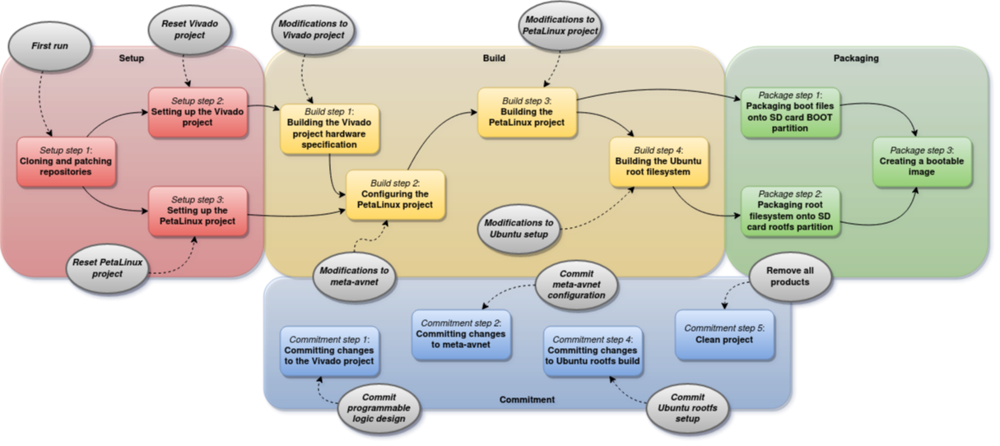

# MPSoC4Drones

██████╗░██╗██╗██╗  
██╔══██╗██║██║██║  
██║░░██║██║██║██║  
██║░░██║██║██║██║  
██████╔╝██║██║██║  
╚═════╝░╚═╝╚═╝╚═╝

🄳🅁🄾🄽🄴 🄸🄽🄵🅁🄰🅂🅃🅁🅄🄲🅃🅄🅁🄴 🄸🄽🅂🄿🄴🄲🅃🄸🄾🄽 🄰🄽🄳 🄸🄽🅃🄴🅁🄰🄲🅃🄸🄾🄽

🅂🄳🅄.🄳🄺/🄳🄸🄸🄸

🄶🄸🅃🄷🅄🄱.🄲🄾🄼/🄳🄸🄸🄸-🅂🄳🅄-🄶🅁🄾🅄🄿

MPSoC project framework for UAV research applications targeting the Ultra96-V2 as UAV companion computer with external PX4 powered flight controller. Tool chain for building images with custom programmable logic design, Ubuntu 20.04, and ROS2. The framework is a wrapper of existing tools for embedded development provided by [Xilinx](https://www.xilinx.com/) as well as scripts provided by [Avnet](https://www.avnet.com/) and the [PYNQ Project](http://www.pynq.io/) for building hardware, OS and packages for the Ultra96-V2.

Prerequisites:

- **Host Platform**: [Ubuntu 20.04 LTS](https://releases.ubuntu.com/20.04/)
- **Tools**: Xilinx [Vivado 2020.2](https://www.xilinx.com/support/download/index.html/content/xilinx/en/downloadNav/vivado-design-tools/2020-2.html) + Xilinx [PetaLinux 2020.2](https://www.xilinx.com/support/download/index.html/content/xilinx/en/downloadNav/embedded-design-tools/2020-2.html)
- At least a 8 GB SD card

The work uses:

- **Target Platform**: [Ubuntu Base 20.04 LTS for Arm64](http://cdimage.ubuntu.com/ubuntu-base/releases/20.04/release/)
- **Target Middleware**: [ROS2 Foxy](https://docs.ros.org/en/foxy/Installation.html)
- **Target Development Board**: Avnet [Ultra96-V2](https://www.avnet.com/shop/us/products/avnet-engineering-services/aes-ultra96-v2-g-3074457345638646173/) with Avnet [U96 JTAG/UART to USB adapter](https://www.avnet.com/shop/us/products/avnet-engineering-services/aes-acc-u96-jtag-3074457345635355958/)

#### A note about `sudo`-privileges:
As we are building OS's, a lot of the manipulated files will be owned by the root user and will therefore require `sudo` to access. Therefore, `sudo` is called throughout the scripts. Whenever a long build is running and a `sudo` call is encountered, the default behavior is to hang until the user provides the password. Therefore, it is recommended enable passwordless `sudo` for the user. This is done as follows:
```bash
echo "$USER ALL=(ALL) NOPASSWD: ALL" | sudo tee -a /etc/sudoers
```
A suggestion could also be to get some familiarity with the tools before doing this, or run everything in a virtual machine, if you don't trust the scripts. At least it doesn't break my machine, but we take no responsibility. 🦖

## Table of contents

- [MPSoC4Drones](#mpsoc4drones)
  * [Features](#features)
  * [Getting started](#getting-started)
    + [The Toolchain at a glance](#the-toolchain-at-a-glance)
    + [Environment setup](#environment-setup)
    + [Toolchain execution](#toolchain-execution)
    + [SD card setup](#sd-card-setup)
    + [Flight controller configuration](#flight-controller-configuration)
    + [First boot](#first-boot)
    + [Connect to the Ultra96-V2 using SSH](#connect-to-the-ultra96-v2-using-ssh)
    + [Testing ROS2 and PX4 communication](#testing-ros2-and-px4-communication)
  * [Development with MPSoC4Drones](#development-with-mpsoc4drones)
    + [The framework](#the-framework)
      - [mp4d-setup](#mp4d-setup)
      - [mp4d-build](#mp4d-build)
      - [mp4d-package](#mp4d-package)
      - [mp4d-commit](#mp4d-commit)
    + [The toolchain](#the-toolchain)
    + [Development cases](#development-cases)
      - [Modifying the FPGA design without changes to memory mapping](#modifying-the-fpga-design-without-changes-to-memory-mapping)
      - [Modifying the FPGA design with changes to memory mapping](#modifying-the-fpga-design-with-changes-to-memory-mapping)
      - [Adding packages to the Ubuntu build](#adding-packages-to-the-ubuntu-build)
      - [Changing the Ubuntu host name, user name, or password](#changing-the-ubuntu-host-name-user-name-or-password)
  * [Acknowledgements](#acknowledgements)

## Features
This work aims to provide an easy-to-use framework for integration projects targeting the Ultra96-V2 board. The framework facilitates integration of FPGA programmable logic design with well-established tools in the UAV research community.

The framework lets you
- Handle the full process of boot image creation for custom UAV applications targeting the Ultra96-V2 board;
- Design full project specific FPGA layouts from a bare-minimum default block design in Xilinx Vivado 2020.2;
- Handle a PetaLinux project using either custom or default FPGA design;
- Automatically incorporate Ultra96-V2 specific meta-layers provided from Avnet into the PetaLinux project;
- Modify the meta-layers of the PetaLinux project in compliance with custom FPGA designs;
- Build the Vivado project and PetaLinux project;
- Build an Ubuntu 20.04 root filesystem ready with ROS2 Foxy and Fast-RTPS for PX4 Flight Controller communication; and
- Package integrated FPGA layout and OS onto a bootable SD card.

## Getting started
This section gives a quick introduction on how to get started with MPSoC4Drones.

### The Toolchain at a glance
The toolchain consists of the following four steps:
1. **Setup**  
Setting up the project structure. In this step, the relevant repositories (from Avnet and PYNQ) are cloned and patched, the Vivado project is generated, and the PetaLinux project is created.
2. **Build**  
Bulding the individual project components. This step contains the building process of the Vivado project, the PetaLinux project, and the Ubuntu root filesystem.
3. **Packaging**  
Packaging the build products. This step covers packaging the build products onto a prepared SD card as well as creating an image for SD card flashing.
4. **Commitment**  
Committing the changes made to the individual parts of the project back to the project setup scripts, such that the project can be revision controlled in another git repository. 

### Environment setup
You can initialize you MPSoC4Drones project by creating a repository based on the MPSoC4Drones template. Simply click the **Use this template** button in this repo!

After creating your repository, clone it:

```bash
git clone <your repo url>
cd <your repo name>
```

Source the MPSoC4Drones settings script:

```bash
source scripts/settings.sh
```

The available commands will be shown in the terminal. Also source your 2020.2 Xilinx tools from the Vivado and PetaLinux installation directories, e.g.

```bash
source /tools/Xilinx/Vivado/2020.2/settings64.sh
source /tools/Xilinx/PetaLinux/2020.2/tool/settings.sh
```

Now you're ready to develop with MPSoC4Drones!

### Toolchain execution
To setup the sub projects, i.e. clone and patch Avnet repositories, setup Vivado project, and setup PetaLinux project, simply run the following command:

```bash
mp4d-setup
```

To build all sub-projects, i.e. build the Vivado project, build the PetaLinux project, and build the Ubuntu root filesystem, simply issue the following command:

```bash
mp4d-build
```

This step will take a while.

Assuming you SD-card is formated as described in the [SD-card setup](#sd-card-setup) section below and mounted at mount points `/media/$USER/BOOT` and `/media/$USER/rootfs`, the SD-card is packaged by commanding

```bash
mp4d-package
```

The SD-card is now ready for boot. When you have made changes to the project, you can commit the changes:

```bash
mp4d-commit
```

The changes are now comitted and ready to be pushed to you repo.

### SD card setup
You will need an SD card with at least 8 GB of memory.

The SD card needs to be partitioned. The partition map needs to be as following: First there must be 100 MiB of free space. Next, there needs to be a FAT32 partition labeled *BOOT* of size 1000 MiB. Finally, with no free space in between, the rest of the space must be formated as an EXT4 partition labeled *rootfs*. One can use the Ubuntu **gparted** app.

### Flight controller configuration
The flight controller needs to be RTPS-compliant. Flash the flight controller with the latest version of the PX4 firmware with the _\_rtps_ subscript. For the best results you can build the firmware from source yourself. 

Apply the following configurations to the flight controller in QGroundControl:
> * SER_TEL1_BAUD   460800 8N1
> * SER_TEL4_BAUD   47600 8N1
> * MAV_0_CONFIG    TELEM/SERIAL4
> * RTPS_CONFIG     TELEM1

In the NuttX shell in QGroundControl, verify the setup with the following command:
```bash
micrortps_client status
```

Using an FTDI-USB chip, make the following connection to the TELEM1 port of the flight controller:
> * GND     -   GND
> * TX      -   RX
> * RX      -   TX

### First boot
Plug the SD-card into the Ultra96-V2, plugin the power, connect the JTAG-adapter, and connect the USB cable to the host computer. Open a serial session at baudrate 115200, e.g. using `screen`. Push the power button on the Ultra96-V2. You will now be able to monitor the boot process, first the boot loader, then the kernel, and finally Ubuntu.

When prompted for a login, supply `mp4d` as both login and password.

Before constructing a custom ROS2 system, build the PX4 Fast-RTPS ROS2 nodes. This only needs to be done once, and is done as follows:

```bash
export MAKEFLAGS="-j 3"
source ~/ros2_ws/src/px4_ros_com/scripts/build_ros2_workspace.bash
```

Using only 3 jobs prevents starvation. This will take a while to finish.

Now, your system is ready for use.

### Connect to the Ultra96-V2 using SSH
Using the JTAG-UART connection to the Ultra96-V2, connect it to your prefered WiFi using `nmcli`. Go to your router administration page on your host computer and look up the IP address of the Ultra96-V2. If you have built using default configuration, the host name is *u96v2*.

SSH into the Ultra96-V2 from a computer on the same network as the Ultra96-V2 by issueing
```bash
ssh mp4d@IP_ADDRESS
```
Type the password `mp4d`. Use your custom login and password if you have built Ubuntu with non-default settings.

### Testing ROS2 and PX4 communication
Power and boot the Ultra96-V2 and the configured flight controller. Make the connection between the two as described above. SSH into the Ultra96-V2 from one terminal. Command:

```bash
source ~/ros2_ws/install/setup.bash

micrortps_agent -d /dev/ttyUSB1
```

Replace `ttyUSB1` with the correct USB serial port.

In a second terminal, SSH into the Ultra96-V2, log in, and issue the following commands:
```bash
source ~/ros2_ws/install/setup.bash

ros2 launch px4_ros_com sensor_combined_listener.launch.py
```

You should now see the sensor data flowing from the flight controller.

## Development with MPSoC4Drones
Development with the MPSoC4Drones framework is straightforward. This section explains the framework in greater details and provides examples on how to use the toolchain in different development scenarios.

### The framework
The framework consists on a directory structure and a set of command line tools, and everything is suplied within this repository. One instance of the repository is cloned for one MPSoC4Drones project. The tools then provide functionality to generate everything necessary.

After cloning the repository and entering the repository directory, the tools are sourced as follows:

```bash
source scripts/settings.sh
```

The individual commands and functionalities are explained below.

#### `mp4d-setup`
The `mp4d-setup` command sets up the project structure in the three following steps:
1. _Setup step 1_: **Cloning and patching repositories**.  
Avnet provides scripts for building projects for their boards in seperate GitHub repositories which interoperate. Therefore, the general project structure is adopted from Avnet. Additionally, the PYNQ Project repository is cloned as some packages are borrowed and install onto the root filesystem from there. The cloned repositories are the following:
    - the [Avnet *bdf* repository](https://github.com/Avnet/bdf) cloned into the `bdf/` folder. This folder will contain the Avnet provided board definition files for the Ultra96-V2, which is used in Vivado to specify the characteristics of the board.
    - the [Avnet *hdl* repository](https://github.com/Avnet/hdl) cloned into the `hdl/` folder. This folder will contain the Vivado specific scripts for project creation and hardware building. The repository is patched from the original provided by Avnet in order to more flexibly facilitate hardware development in Vivado, and also to define a bare minimum Vivado project necessary for the OS to be able to run. Inside this folder will also be contained the actual Vivado project for the MPSoC4Drones project.
    - the [Avnet *petalinux* repository](https://github.com/Avnet/petalinux) cloned into the `petalinux/` folder. This folder will contain the PetaLinux specific scripts for project creation and PetaLinux building. The repository is patched from the original provided by Avnet in order to more flexibly facilitate development with/without updating the hardware specification, without rebuilding everything, etc. Inside this folder will also be contained the actual PetaLinux project for the MPSoC4Drones project.
    - the [Avnet *meta-avnet* repository](https://github.com/Avnet/meta-avnet) cloned into the `meta-avnet/` folder. This folder will contain the meta-layers provided by Avnet for the PetaLinux build. These layers define, among other things, patches to the kernel, hardware drivers, etc., specific to the Ultra96-V2, as well as the kernel driver configuration for the PetaLinux project. The repository is patched from the original provided by Avnet in order to remove specification of excessive packages to be installed in the user layer of the root filesystem built by PetaLinux, as this filesystem is replaced in MPSoC4Drones by a Ubuntu 20.04 filesystem, and this modification significantly decreases build time, as well as to add some additional kernel drivers necessary for PX4 communication to the build.
    - The [PYNQ Project *PYNQ* repository](https://github.com/Xilinx/PYNQ) cloned into the `PYNQ/` folder. This folder will contain full the full PYNQ Project, however, only a few elements are used. The BitBake recipes for ZOCL/XRT drivers in the root filesystem `recipes-xrt` are used along with patched scripts to install a few packages into the root filesystem which must be cross-compiled from source. This is achieved in the PYNQ Project, and is thus included in this build.
2. _Setup step 2_: **Setting up the Vivado project**.  
Using the scripts in the patched version of the Avnet *hdl* repository now contained in the `hdl/` folder, the Vivado project is created on the path `hdl/projects/u96v2_sbc_mp4d_2020_2/`. The default bare-minimum block design is generated, the board definition files are added, and a constraints file is added to the project for reference and later pinout. If any commits of changes to the block design, added IPs in the `ip/` folder, or added sources, these will be fetched from the respective folders and reflected in the generated project. See the _commitment_ step below. This step requires that _setup step 1_ has been executed.
3. _Setup step 3_: **Setting up the PetaLinux project**.  
Using the scripts in the patched version of the Avnet *petalinux* repository now contained the `petalinux/` folder, the PetaLinux project is created on the path `petalinux/projects/u96v2_sbc_mp4d_2020_2/`. This step requires that _setup step 1_ has been executed.

The command has the following options:
- Calling `mp4d-setup`, `mp4d-setup -A`, or `mp4d-setup --all` will issue _setup step 1_, _2_, and _3_ above. For any step that has already been executed, the user will be prompted for yes/no about whether the setup should continue and erase all previous changes.
- Calling `mp4d-setup` with one or more of the following options will issue the respective steps:
  - `-G`, `--git` for _setup step 1_,
  - `-V`, `--vivado` for _setup step 2_, and
  - `-P`, `--petalinux` for _setup step 3_.  
The `-A`, `--all` option will overrule the above options and issue all steps regardless.
- For any step, the user will be prompted if the step has already been executed. Adding the `-f`, `--force` option will overwrite previous changes without prompting the user for yes/no.

In general, the `mp4d-setup` command only needs to be called once during project creation, but can also be useful if the user wants to reset parts of the MPSoC4Drones project to default, or if the user wants to regenerate the project after calling `mp4d-commit --clean` (see the _commitment_ step below).

#### `mp4d-build`
The `mp4d-build` command builds the project in the five following steps:
1. _Build step 1_: **Building the Vivado project hardware specification**.  
This step runs synthesis and implementation on the Vivado project contained in the `hdl/projects/u96v2_sbc_mp4d_2020_2/` folder. The build utilizes the patched versions of the Avnet hdl build scripts. The design bitstream is generated and the hardware specification .xsa file is exported. This step requires that _setup step 2_ has been executed.
2. _Build step 2_: **Configuring the PetaLinux project**.  
This step configures the PetaLinux project for build, imports the generated hardware specification, imports the Avnet meta-layers, and imports the BitBake recipes for ZOCL/XRT kernel modules from the PYNQ repo. This step requires that _setup step 3_ and _build step 1_ have been executed.
3. _Build step 3_: **Building the PetaLinux project**  
This step builds the PetaLinux project contained in the `petalinux/projects/u96v2_sbc_mp4d_2020_2/` folder, including the boot loader and the kernel. The boot files, kernel modules, kernel packages, and kernel module firmware files are stored in the respective folders in the `target/` directory. This step requires that _build step 2_ has been executed.
4. _Build step 4_: **Building the Ubuntu root filesystem**  
This step builds the Ubuntu 20.04 root filesystem, including installing necessary packages, setting up the root user and the primary user, installing ROS2, and setting up PX4 Fast-RTPS communication. The built root filesystem is contained in the directory `target/rootfs/`. If this step has been executed once and the PetaLinux project has consecutively been built again (_build step 3_), this step will not rebuild the full root filesystem but will only update the PetaLinux kernel modules outputs to reduce unnecessary time waste, unless explicitly commanded. This step requires that _build step 3_ has been executed.

The command has the following options:
- Calling `mp4d-build`, `mp4d-build -A`, or `mp4d-build --all` will issue _build step 1_, _2_, _3_, and _4_. For any step _1_, _2_, or _3_ that has already been executed, the user will be prompted for yes/no about whether the build should continue and erase all previous build outputs. For _build step 4_, if the step has previously been executed, the root filesystem will not be rebuilt but the latest kernel module file from _build step 3_ will be imported.
- Calling `mp4d-build` with one or more of the following options will issue the respective steps:
  - `-V`, `--vivado` for _build step 1_,
  - `--petalinux-config` for _build step 2_,
  - `-P`, `--petalinux` for _build step 3_, and
  - `-U`, `--ubuntu` for _build step 4_.
The `-A`, `--all` option will overrule the above options and issue all steps regardless.
- For any step _1_, _2_, or _3_, the user will be prompted if the step has already been executed. Adding the `-f`, `--force` option will overwrite previous build products without prompting the user for yes/no. Additionally, adding the `-f`, `--force` option when executing _build step 4_ will issue a full rebuild of the root filesystem, regardless of previous builds.

#### `mp4d-package`
The `mp4d-package` command packages the project build products in the following steps:
1. _Packaging step 1_: **Packaging boot files onto SD card BOOT partition**.  
This step packages the BOOT files contained in the `target/BOOT/` folder onto the BOOT partition of the SD card. This step requires that _build step 3_ has been executed.
2. _Packaging step 2_: **Packaging the root filesystem onto the SD card rootfs partition**.  
This step packages the full root filesystem contained in the `target/rootfs/` folder on the rootfs partition of the SD card. This step requires that _build step 4_ has been executed.
3. _Packaging step 3_: **Creating a bootable image**.  
This step packages the BOOT and rootfs partitions onto a bootable image which can be distributed and can be flashed onto an SD card with a tool like BalenaEtcher. ***THIS HAS NOT BEEN IMPLEMENTED YET***

 The command has the following options:
- Calling `mp4d-package`, `mp4d-pacakge -A`, or `mp4d-package --all` will issue _package step 1_, _2_, and _3_. For any step that has already been executed, the user will be prompted for yes/no about whether the packaging should continue and erase previous packaged contents.
- Calling `mp4d-package` with one or more of the following options will issue the respective steps:
  - `-B`, `--boot` for _packaging step 1_,
  - `--rootfs` for _packaging step 2_, and
  - `-I`, `--image` for _packaging step 3_.
The `-A`, `--all` option will overrule the above options and issue all steps regardless.
- The `--mount-dir MOUNT_DIR` argument can be used to specify the directory `MOUNT_DIR` containing the `BOOT/` and `rootfs/` mount points. `MOUNT_DIR` defaults to `/media/$USER/`.
- The `--boot-dir BOOT_DIR` argument can be used to specify the BOOT partition mount point `BOOT_DIR`. Setting this argument will overwrite the BOOT partition mount point derived from `MOUNT_DIR`. As such, `BOOT_DIR` defaults to `MOUNT_DIR/BOOT/`.
- The `--rootfs-dir ROOTFS_DIR` argument can be used to specify the rootfs partition mount point `ROOTFS_DIR`. Setting this argument will overwrite the ROOTFS partition mount point derived from `MOUNT_DIR`. As such, `ROOTFS_DIR` defaults to `MOUNT_DIR/rootfs/`.
- For any step, the user will be prompted if the step has already been executed. Adding the `-f`, `--force` option will overwrite previously packaged contents without prompting the user for yes/no.

#### `mp4d-commit`
The `mp4d-commit` command commits changes made to the project in the following steps:
1. _Commitment step 1_: **Committing changes made to the Vivado project**.  
This step modifies the setup scripts such that the design changes applied to the initial Vivado project is preserved through running the setup scripts again. This is achieved by adding any source design files and IPs to the patch that is applied to the Avnet hdl repository in _setup step 1_. Additionally, the tcl script which generates the block design is updated to reflect the resulting design. Finally, the constraints file is updated to preserve changes. The updated patch file _hdl_repo.patch_ is committed to git along with the constraints file, the block design script, and any added IPs or VHDL source files in the `ip/` and `src/` directories, respectively. This step requires that _setup step 1_ and _2_ has been executed.

2. _Commitment step 2_: **Committing changes made to the meta-avnet layers**.  
In this step, changes applied to the meta-avnet layers in the `meta-avnet/` folder for the PetaLinux build is similarly pushed back to the patch which is applied to the Avnet meta-avnet repository in _setup step 1_. Any modification made in the `meta-avnet/` folder is preserved. The updated patch file `patches/meta-avnet\_repo.patch` is committed to git. This step requires that _setup step 1_ has been executed.

3. _Commitment step 3_: **Committing changes made to the Ubuntu rootfs setup-scripts**. This step simply commits changes made to the Ubuntu build scripts contained in the `scripts/ubuntu/` folder. Though the functionality is trivial, the step is included to keep consistency in the framework.  This step requires that _setup step 1_ has been executed.

4. _Commitment step 4_: **Cleaning the project**. This steps removes all of the generated files and folders in the project. Specifically, the step will remove all files listed on the `.gitignore`. Only to be executed after having committed all changes to be kept through the above commitment steps, the functionality in this final step of the framework workflow prepares the project for distribution and versioning on git. All untracked files will be removed, so be careful.

The command has the following options:
- Calling `mp4d-commit` will issue _commitment step 1_, _2_, and _3_.
- Calling `mp4d-commit -A`, or `mp4d-commit --all` will issue the same three steps but will add a broader range of changes to the commit. Should only be used if the fundamental scripts are changed.
- Calling `mp4d-commit` with one or more of the following options will issue the respective steps:
  - `-V`, `--vivado` for _commitment step 1_,
  - `-M`, `--meta-avnet` for _commitment step 2_, and
  - `-U`, `--ubuntu` for _commitment step 3_.
The `-A`, `--all` option will overrule the above options and issue all steps regardless.
- Adding the `--clean` option will issue _commitment step 4_. The user will be prompted if the project should really be cleaned, as this operation deletes data.
- Adding the `-f`, `--force` option with the `--clean` option will clean the project without prompting the user.

### The toolchain

The above figure visualizes the the toolchain workflow. The red rectangles are the _setup_ steps, the yellow rectangles are the _build_ steps, and the green rectangles are the _packaging_ steps. Additionally, the blue rectangles are the _commitment_ steps. The dotted arrows indicate the precedence of the steps, i.e. traversing the arrows backwards indicates which previous steps are necessary for executing a given step. The grey circles indicate development actions by the user, and the arrows from the grey circles to the development steps indicate the necessary build entry points after/when having taken a given development action.

### Development cases
In this section, various development scenarios are given as general examples and it is described how the scenarios are built within the MPSoC4Drones framework.

#### Modifying the FPGA design without changes to memory mapping
After having executed the _setup_ steps, the user can make changes to the FPGA design to be written to the programmable logic on the MPSoC chip using Vivado 2020.2. The following process applies:
1. Open the project file `hdl/projects/u96v2_sbc_mp4d_2020_2/u96v2_sbc_mp4d.xpr` with Vivado.
2. Make any non-memory mapped changes to the project, modify the block design, add new sources, etc. If any pinout is required, use the provided constraints file.
3. Validate and save the design. Close or keep open Vivado.
4. Enter the MPSoC4Drones toolchain from _build step 1_ as specified by development action "Modifications to Vivado project".

#### Modifying the FPGA design with changes to memory mapping
After having executed the _setup_ steps, the user can additionally make changes to the FPGA design which maps into the physical memory of the Ubuntu OS. This is a little more involved than writing hardware which is not memory mapped. In order to map into the physical memory og the OS, the IPs in the block design needs to connect to the AXI bus of the Zynq processor system. Hardware IPs which are connectable to AXI are either provided by a vendor, such as Xilinx' AXI enabled IPs, or can be customly written in Vitis HLS (advanced usage). Writing custom hardware IPs is beyond the scope of this readme. Having the AXI compatible IP to be added at hand, the following process applies:
1. Open the project file `hdl/projects/u96v2_sbc_mp4d_2020_2/u96v2_sbc_mp4d.xpr` with Vivado, add the IP correctly to the block design and connect the AXI interface. Validate and save. Enter the MPSoC4Drones toolchain from _build step 1_.
2. If it is an Xilinx IP, the PetaLinux project can be configured to include the drivers for the IP in the kernel build. This is done by finding the corresponding kernel configuration parameter and setting it in the file `meta-avnet/recipes-kernel/linux/files/u96v2-sbc/bsp.cfg`.
3. If it is a custom IP, the drivers must be manually added. ** Work in progress **
4. Changes to the device tree possibly needs to be made. The device tree can be modified in the file `meta-avnet/recipes-bsp/device-tree/files/u96v2-sbc/system-bsp.dtsi`.
5. After having finished modifying the meta-avnet layer, enter the MPSoC4Drones toolchain from _build step 2_.

#### Adding packages to the Ubuntu build
Adding more packages to the Ubuntu build is as simple as as adding the names of the packages as given in `apt install PACKAGE_NAME` to a file. The following process applies:
1. Append the names of the packages you want to include in the build to the file `scripts/ubuntu_packages.txt`. Be careful to write the names of the packages correctly, the build will fail if the specified packages doesn't exist.
2. Enter the MPSoC4Drones toolchain from _build step 4_.

#### Changing the Ubuntu host name, user name, or password
Changing the Ubuntu host name, user name, or user and root password is done by changing the variables specified as follows:
1. Change the relevant variables in the file `scripts/settings.sh`.
2. Enter the MPSoC4Drones toolchain from _build step 4_.

## Acknowledgements
Everything in this repository is heavily based on the work of others, especially the guys from [Avnet](https://www.avnet.com/wps/portal/us/products/avnet-boards/avnet-board-families/ultra96-v2/). Additionally, it is a work in progress, so bugs due to different OS or tool versions may arise. We work continuously to upgrade the system to the latest available tools. Please raise an issue if you experience any bugs that are not already reported.

Some additional references we've used to stitch together this work:
- [Wi-Fi Connectivity on the Ultra96-V2 in Vivado+PetaLinux 2019.2](https://www.hackster.io/news/wi-fi-connectivity-on-the-ultra96-v2-in-vivado-petalinux-2019-2-493a709b7f25)
- [Running Ubuntu 18.04 on Ultra96v2 Using Petalinux 2019.2, with Networking](https://highlevel-synthesis.com/2019/12/15/running-ubuntu-on-ultra96v2-using-petalinux-2019-2-with-networking-and-linux-header/)
- [Tips for Integrating WiFi on the Ultra96-V2](https://www.element14.com/community/groups/fpga-group/blog/2020/01/30/lessons-learned-from-debugging-wifi-access-point-on-ultra96-v2)
- [Ultra96-PYNQ](https://github.com/Avnet/Ultra96-PYNQ)
- [ZynqMP-FPGA-Ubuntu20.04-Lima-Ultra96](https://github.com/ikwzm/ZynqMP-FPGA-Ubuntu20.04-Lima-Ultra96)
- [ZynqMP-FPGA-Ubuntu20.04-Ultra96](https://github.com/ikwzm/ZynqMP-FPGA-Ubuntu20.04-Ultra96)
- [ZynqMP-FPGA-Linux](https://github.com/ikwzm/ZynqMP-FPGA-Linux)
- [Ultra96-V2 ultra-hard-story with WiFi of](https://titanwolf.org/Network/Articles/Article?AID=e801481c-6969-425e-8ce2-77c2edf0e63e#gsc.tab=0)
- [u96v2-wilc-driver](https://github.com/Avnet/u96v2-wilc-driver)
- [Patching the Linux Kernel with devshell in PetaLinux 2020.2](https://www.centennialsoftwaresolutions.com/post/patching-the-linux-kernel-with-devshell-in-petalinux-2020-2)
